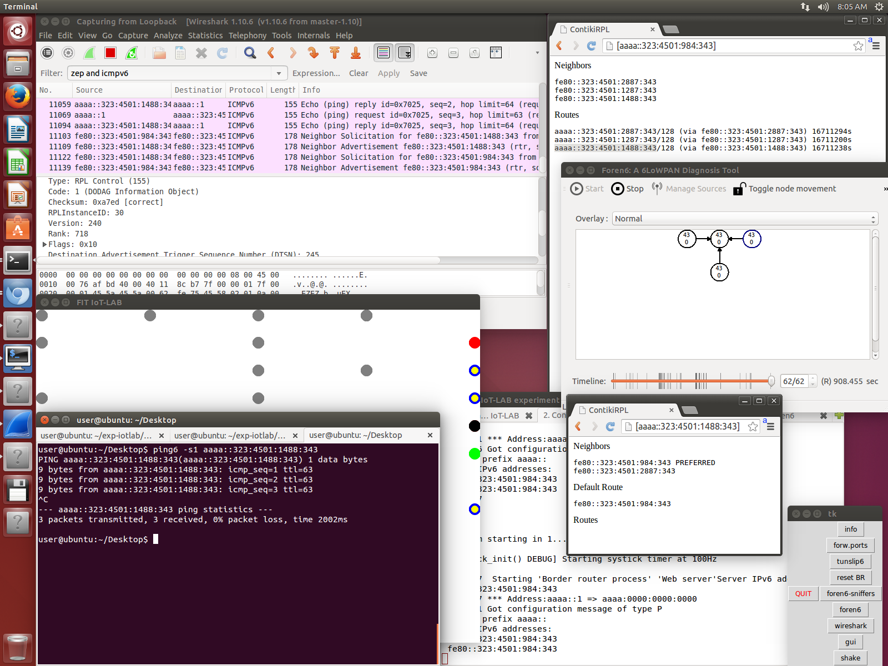

# Launching an experiment with Contiki and RPL

It is assumed here that you have a running VM as described in
[Installing a VM with all software and tools](README-vm.md).

The experiment is essentially the one described by
IoT-LAB tutorial for [contiki IPv6 stack and tools](https://www.iot-lab.info/tutorials/contiki-ipv6-stack-and-tools/), with [HOWTO use Foren6 to diagnose in realtime your 6LoWPAN experiment](https://github.com/iot-lab/iot-lab/wiki/HOWTO-use-Foren6-to-diagnose-in-realtime-your-6LoWPAN-experiment),
please refer to these pages to really understand what is happening.


1) Start by re

```
cd tools
./expctl init ExpContikiRpl.py --site strasbourg --nb-nodes 8 --nb-foren6-sniffers 2 --duration 20
```
This will start an experiment of duration 20 minutes,
with 8 nodes at the site of "strasbourg",
flashed according to instructions of the command line:
- It will be a "contiki" experiment by default, hence one of the nodes will
  be implicitely a "border-router".
- 2 of the nodes will be sniffers (with foren6 format).
- the remaining nodes will be flashed with "default" firmware (without radio,
  actually: [example_event](https://github.com/hikob/openlab/tree/master/appli/examples/event) from IoT-LAB/openlab).

Note that if an experiment is currently running, the script will reuse it.

8) Run the gui launcher
```
python TkExp.py
```

Then proceed as follows:

- click on "forw.ports" to establish a ssh tunnel to the nodes (border router and sniffers),
  A terminal should appear running an 
  ```ssh ... -L ... -L ...``` command (as a byproduct you would have to 
  type your ssh key passphrase).
- click on "tunslip6". This will start tunslip6
  (as described in [tutorial](https://www.iot-lab.info/tutorials/contiki-ipv6-stack-and-tools/), step 7, but this is automated here).
- click on "reset BR". This will reset the border router and will confirm
  that everything is well connected. After  a small delay 
  you should see ```Starting 'Border router process' 'Web server'```
- you should be able to access the web server in your web-browser with an
  address such as: ```http://[aaaa::323:4501:984:343]```.
  See [tutorial](https://www.iot-lab.info/tutorials/contiki-ipv6-stack-and-tools/ for details. 
- click on "foren6-sniffers". This will start a program connecting to the
  sniffer nodes, reading their serial (foren6/snif format), and:
  * outputting the packets in the "snif" format on pty /tmp/myttyS0
  * outputting the packets in the ZEP format (UDP) on loopback
- click on "wireshark". After some warnings (due to sudo wireshark),
  wireshark would start. You should see the RPL DODAGs, and router advertizements from the border router.
- click on "foren6". This will start foren6.
  It needs to be configured along to the steps given in the IoT-LAB tutorial [HOWTO use Foren6](https://github.com/iot-lab/iot-lab/wiki/HOWTO-use-Foren6-to-diagnose-in-realtime-your-6LoWPAN-experiment).
  * click on manage sources, and add: Target=`/tmp/myttyS0` Type=`snif`
  (channel irrelevant)
  * click on start -> you should see a node
- you should be seeing one single circle. This is the border router.
- now comes the TODO part :). You can start the other (unfinished) "GUI" with 
  by clicking on "GUI", and a new window with points appears after 2 sec or so:
  * points are nodes. gray = not reserved, green = border router, 
    red = sniffer, black = default-firmware (the one doing nothing on the radio). Note that sites are in 3D, whereas the map is in 2D, so
    some nodes are "hidden" (currently).
  * select some black nodes by right clicking (their center becomes yellow)
    (remember that some nodes are hidden due to 3D -> 2D).
  * press several times on the secret key "+", to select the firmware
    "contiki-rpl-node".
  * once this is done, press on the key "f", to flash the selected nodes
    (the ones with yellow), with contiki firmware. Be sure to check output
    on the terminal. 
  * looking at wireshark, the newly flashed nodes should be sending RPL DIS
    messages (DODAG Information Sollicitation) until they join the network, 
    and then RPL DIO messages (DODAG Information Object).
  * looking at foren6, notice that new nodes have appeared 
    _Currently the graph might not be displayed instantly, 
       this requires investigation_
  * refreshing the web page of the router you can see the actual addresses
    of the nodes
  * you can ping the nodes, with ```ping6 -s1 <IPv6 address of the node>```.
    ICMP Echo messages goe through the border router, and then on the air
    as 6LoWPAN packets (using the routes discovered by RPL). You should see
    packets-on-the-air with wireshark.
  * you can also directly access the nodes through the web interface.

At the end, you should get something like the following screenshot:



