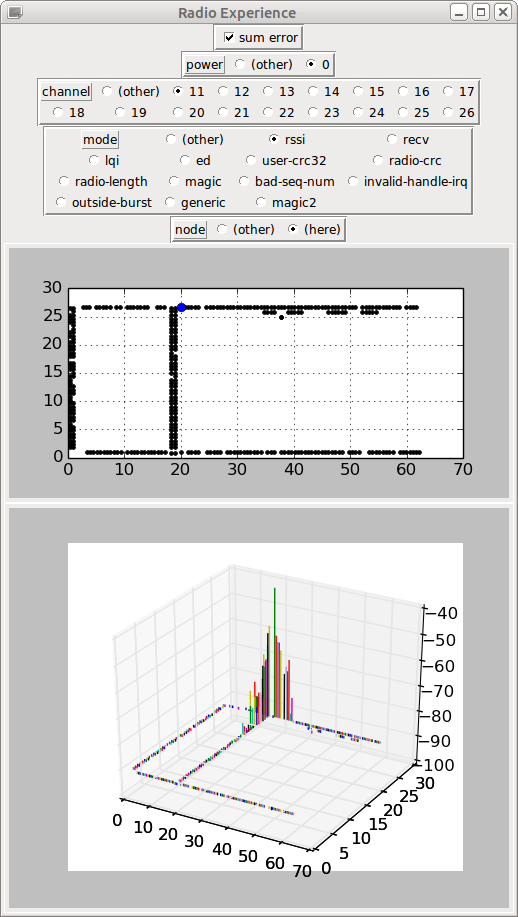
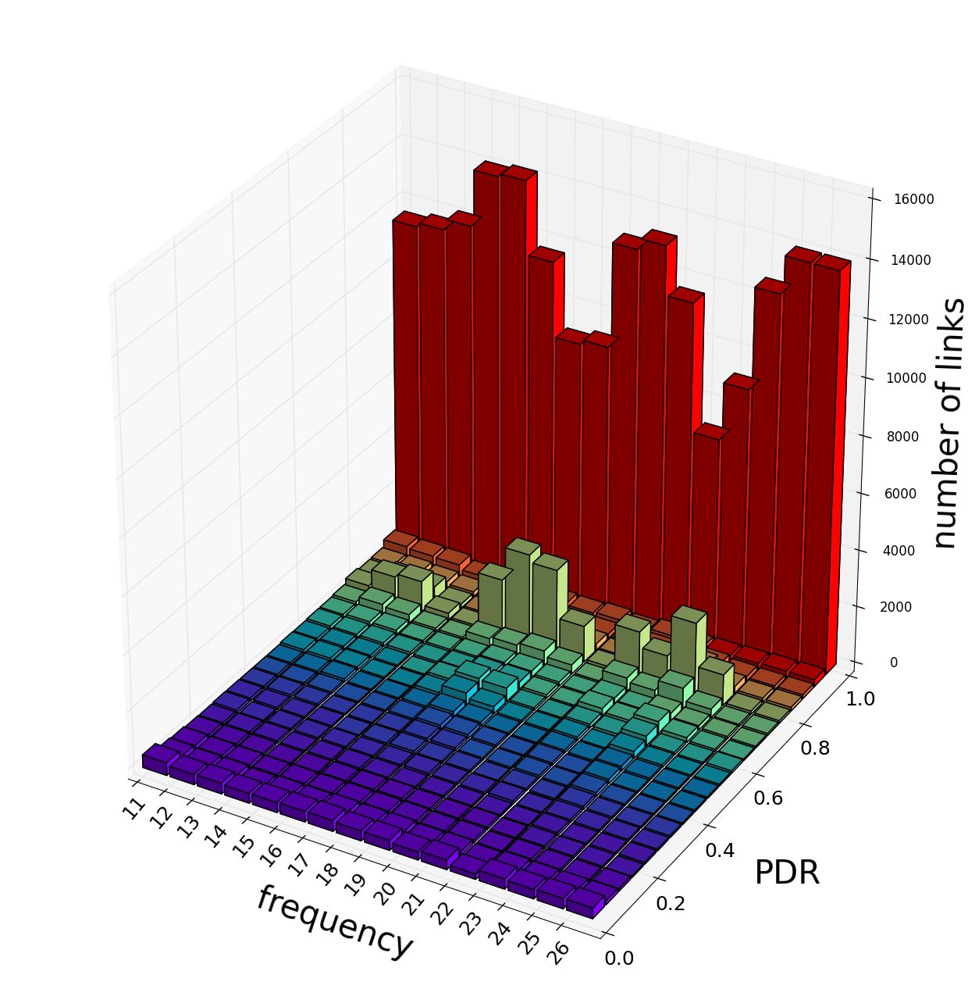

# exp-iotlab (branch radio-exp)

---------------------------------------------------------------------------

 

This is the branch of exp-iotlab including software that can be used
to establish a radio map of IoT-LAB.

* Detailed information about displaying/creating/processing radio maps is in [README-RadioExp-Data](tools/README-RadioExp-Data.md)

* Some raw datasets are available [at this location](http://hipercom.inria.fr/IoT-LAB-dataset/).

* The firmware is a modified version of one firmware by Gaetan Harter:
  * original: [node_radio_characterization](https://github.com/iot-lab/openlab/tree/master/appli/iotlab/node_radio_characterization) from IoT-LAB (by Gaetan)
  * derived: [radio_test in openlab fork, branch ``radio-exp``](https://github.com/adjih/openlab/tree/radio-exp/devel/radio_test)

* One analysis of the dataset `2015-02-04-23h02m50` was published in:
  * T. Watteyne, C. Adjih and X. Vilajosana,
  *"Lessons Learned from Large-scale Dense IEEE802.15.4 Connectivity Traces"*,
  IEEE CASE 2015

---------------------------------------------------------------------------
